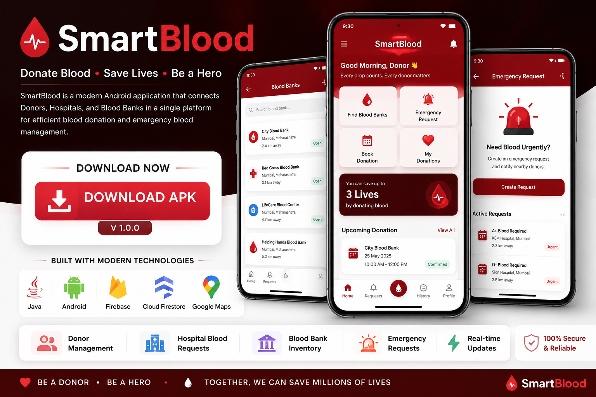

<div align="center">



# 🩸 SmartBlood

### Smart Blood Donation & Emergency Management System

**Connecting Donors • Hospitals • Blood Banks**

<br>

[](https://github.com/varunyadav2001/Blood_bank/releases/download/v1.0.0/app-debug.apk)

[](https://github.com/varunyadav2001/Blood_bank)

[](https://github.com/varunyadav2001/Blood_bank/releases)

</div>

---

## 🩸 About SmartBlood

**SmartBlood** is a modern Android-based blood donation and emergency blood management platform designed to connect **Donors, Hospitals, and Blood Banks** through a single digital ecosystem.

The application helps users manage blood requests, donation appointments, emergency requirements, blood inventory and real-time coordination.

---

## ✨ Key Features

<table>
<tr>
<td width="33%" align="center">

### 👤 Donor

Blood donation & emergency response

</td>

<td width="33%" align="center">

### 🏥 Hospital

Blood requests & emergency management

</td>

<td width="33%" align="center">

### 🏦 Blood Bank

Inventory & donation management

</td>
</tr>
</table>

---

## 👤 Donor Module

- 🔐 Donor Registration & Login
- 🩸 Blood Group Profile
- 🏦 Blood Bank Search
- 📅 Donation Appointment Booking
- ⏰ Appointment Date & Time
- 📋 Upcoming Donation
- 📜 Donation History
- 🚨 Emergency Blood Requests
- ✅ Emergency Response
- ❤️ Lifesaving Impact

---

## 🏥 Hospital Module

- 🔐 Hospital Registration & Login
- 🩸 Create Blood Requests
- 🚨 Create Emergency Requests
- 📋 Request Management
- 🔎 Blood Bank Search
- 📍 Location-based Services
- 📊 Request Tracking
- 👤 Donor Response Tracking

---

## 🏦 Blood Bank Module

- 🔐 Blood Bank Registration & Login
- 🩸 Blood Inventory
- 📋 Hospital Requests
- 📅 Donor Appointments
- ✅ Request Approval
- 🔄 Stock Transfers
- 📦 Inventory Management
- ✔️ Donation Completion

---

# 🚨 Emergency Blood Workflow

```text
🏥 HOSPITAL
      │
      ▼
🚨 Create Emergency Request
      │
      ▼
🔥 Active Emergency
      │
      ▼
👤 Eligible Donors
      │
      ▼
✅ I'm Available
      │
      ▼
🏥 Hospital Receives Response
      │
      ▼
🩸 Blood Requirement Fulfilled
